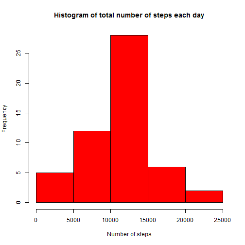
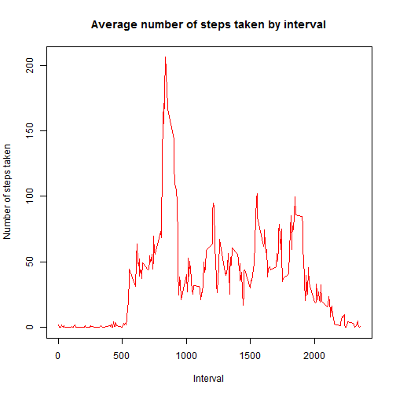
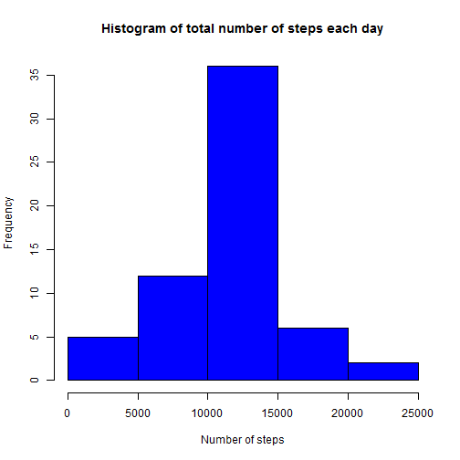
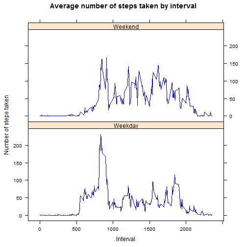

#Project 1 Report
Author: Ashlyn Tan  
Date: 2016-11-08

##Introduction

This report is the project assignment 1 for Reproducible Research course in Coursera's Data Science specialization track. This assignment makes use of data from a personal activity monitoring device. This device collects data at 5 minute intervals through out the day and the data consists of two months of data from an anonymous individual collected during the months of October and November, 2012 and include the number of steps taken in 5 minute intervals each day.

##Data

The data for this assignment was downloaded from the course web site:

Dataset: Activity monitoring data [52K]
The variables included in this dataset are:

steps: Number of steps taking in a 5-minute interval (missing values are coded as NA)

date: The date on which the measurement was taken in YYYY-MM-DD format

interval: Identifier for the 5-minute interval in which measurement was taken

The dataset is stored in a comma-separated-value (CSV) file and there are a total of 17,568 observations in this dataset.

##Preprocessing of data

- Downloading of file

```r
if(!file.exists("getdata-projectfiles-UCI HAR Dataset.zip")) {
    temp <- tempfile()
    download.file("http://d396qusza40orc.cloudfront.net/repdata%2Fdata%2Factivity.zip",temp)
    unzip(temp)
    unlink(temp)
}
```


- Reading of the data file and formatting

```r
x=read.csv('activity.csv',stringsAsFactors = FALSE, header=TRUE)
x$date=as.Date(x$date, format="%Y-%m-%d")
```

##Analysis : Part 1 

The first part of the analysis is conducted by ignoring the missing values in the data


```r
x.na=x[!is.na(x),]
```

- Finding the mean total number of steps taken per day

The number of steps is summed up according to the respective day to get the total number of steps each day and is then used to construct the histogram shown below.


```r
totalsteps=aggregate(steps~date, data = x.na, sum)
hist(totalsteps$steps,main='Histogram of total number of steps each day',
     xlab='Number of steps',col='red')
```



```r
rmean=mean(totalsteps$steps)
rmedian=median(totalsteps$steps)
```

The mean number of total steps taken per day is found to be 1.0766189 &times; 10<sup>4</sup>.
The median of the total number of steps taken per day is 10765.

- Finding average daily activity pattern  

The mean number of steps are averaged according to the interval and used to plot a time seris graph showing the average daily activity pattern.  

```r
averagesteps=aggregate(steps~interval, data =x.na, mean)
plot(averagesteps$interval,averagesteps$steps,type='l', xlab='Interval',
     main='Average number of steps taken by interval', col='red', 
     ylab='Number of steps taken')
```



```r
rinterval=averagesteps[which.max(averagesteps$steps),'interval']
```
The interval with the highest number of average steps is 835.  

##Analysis : Part 2  
The second part of the assignment uses all data with the missing values being replaced by the average number of steps of the respective interval found in the first part of the analysis.  

- Imputing missing values


```r
rna.rows=nrow(x[is.na(x),])
```

The number of rows with missing values is 2304.  


```r
y=x
for (i in 1:nrow(y)){
    if (is.na(y[i,'steps'])==TRUE){
        y[i,'steps']=averagesteps[y[i,'interval']==averagesteps$interval,'steps']
    }
}
```

The missing values are imputed using the average number of steps of the corresponding interval found in the first part of the analysis.

- Finding the mean total number of steps taken per day  

The number of steps is summed up according to the respective day to get the total number of steps each day and is then used to construct the histogram shown below.  


```r
ytotalsteps=aggregate(steps~date, data = y, sum)
hist(ytotalsteps$steps,main='Histogram of total number of steps each day',
     xlab='Number of steps',col='blue')
```



```r
rymean=mean(ytotalsteps$steps)
rymedian=median(ytotalsteps$steps)

dmean=rymean-rmean
dmedian=rymedian-rymedian
```

The mean and median total number of steps taken per day are 0 and 0 respectively. The differences between the estimates from the first part of the assignment and the estimates from the second part of data are 0 and 0 respectively.  

- Activity patterns between weekdays and weekends  

A new factor variable is created with two levels -- "weekday" and "weekend" indicating whether a given date is a weekday or weekend.  
A panel plot containing the time seris plot constructed for weekdays and weekend is plotted. From the panel plot, it can be inferred that the participant is more active during weekend with more higher activity levels occuring throughout.  


```r
weekdays=c('Monday','Tuesday','Wednesday',"Thursday","Friday")

y$day=as.factor(ifelse(is.element(weekdays(as.Date(y$date)),weekdays), "Weekday", "Weekend"))

yaveragesteps=aggregate(steps~interval + day, data =y, mean)

library('lattice')
xyplot(yaveragesteps$steps ~ yaveragesteps$interval | yaveragesteps$day,type='l',
       main='Average number of steps taken by interval', xlab='Interval',
       ylab='Number of steps taken', col='blue', layout=c(1,2))
```


